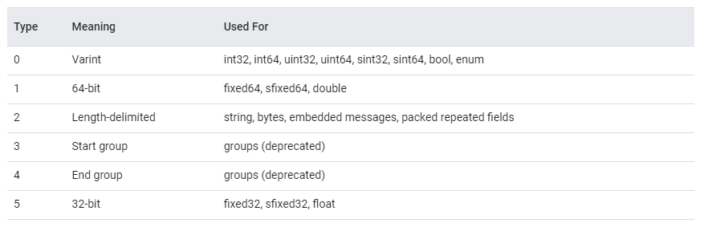

# gRPC 동작 원리

## RPC 흐름

- RPC 시스템에서 서버는 원격으로 호출되는 기능을 구현한다
- 클라이언트 애플리케이션은 서버에서 제공하는 동일한 함수에 대해 추상화를 제공하는 스텁을 생성해 클라이언트 애플리케이션이 서버 애플리케이션의 원격 함수를 호출하는 스텁 함수를 직접 호출한다.

#### 클라이언트

1. 프로시저 호출
2. 스텁이 인코딩 메시지로 요청 생성

#### 네트워크

3. 메시지 전송

#### 서버

4. 메시지 헤더 검사 후 서버 스텁에 메시지 전달
5. 스텁은 메시지 바이트를 언어별 데이터 구조로 복원
6. 스텁은 함수를 로컬로 호출
7. 서비스 함수의 응답이 인코딩된 후 클라이언트로 다시 전송

#### gRPC 와 RPC 차이점

- 메시지 인코딩 방식
- gRPC는 프로토콜 버퍼 사용
- 프로토콜 버퍼는 구조화된 데이터를 직렬화 하기 위한 언어에 제한되지 않고 플랫폼 중립적이며 확장 가능한 매커니즘을 가짐

## 프로토콜 버퍼를 사용한 메시지 인코딩

![4. gRPC: Under the Hood - gRPC: Up and Running [Book]](README.assets/grpc_0402.png)

- 태그는 필드 인덱스와 wire type 의 두가지 값으로 구성된다. 
- 필드 인덱스는 프로토 파일에서 메시지를 정의할 때 각 메시지 필드에 할당된 고유 번호이다 



#### 태그 값 구조

```
Tag value = (field_index << 3) | wire_type
```

필드 인덱스 + 와이어 타입 (3비트)


- 프로토콜 버퍼틑 문자열을 UTF-8을 사용해 값을 인코딩하고 int32 필드 타입인 정수값은 가변 길이 정수라는 인코딩 기술을 사용한다 
- 메시지가 인코딩되면 태그와 같이 바이트 스트림으로 연결된다
- 스트림 끝은 0이라는 태그 값을 전송해 표시한다 


### 인코딩 기술

메시지 정의를 설계할 대 각 데이터 유형에서 데이터가 인코딩되는 방법은 중요하다 

메시지가 런타임에 효율적으로 인코딩되도록 각 메시지 필드에 가장 적합한 데이터 타입으로 설정할 수 있기 때문이다 

#### 가변 길이 정수

하나 이상의 바이트를 사용해 정수를 직렬화하는 방법

대부분 숫자가 균등하게 분포돼 있지 않다는 점에 기반한다 

각 값에 할당된 바이트 수는 고정돼 있지 않고 값에 따라 다르다 

마지막 바이트를 제외한 바이트에 앞으로 더 많은 바이트가 있음을 나타내기 위해 최상휘 비트 Most Significnat Bit 가 1이 된다 

각 바이트의 하위 7비트는 해당 수에 대한 2의 보수 표현으로 저장되며 최하위 비트 least significant bit 가 먼저 나오기 땜문에 하위 그룹 low-order group 에 연속 비트를 추가해야 한다. (121쪽 옮긴이의 메모 참조 필요)

#### 부호 있는 정수

양수와 음수를 모두 갖는 타입으로 `sint32` , `sint64` 같은 필드 타입이 부호 있는 정수로 간주된다.

부호 있는 타입의 경우 zigzag 인코딩이 부호 있는 정수를 부호 없는 정수로 변환하는데 사용된다

변환한 다음에는 부호 없는 정수는 가변 길이 정수 인코딩 방법을 사용해 인코딩 한다 

