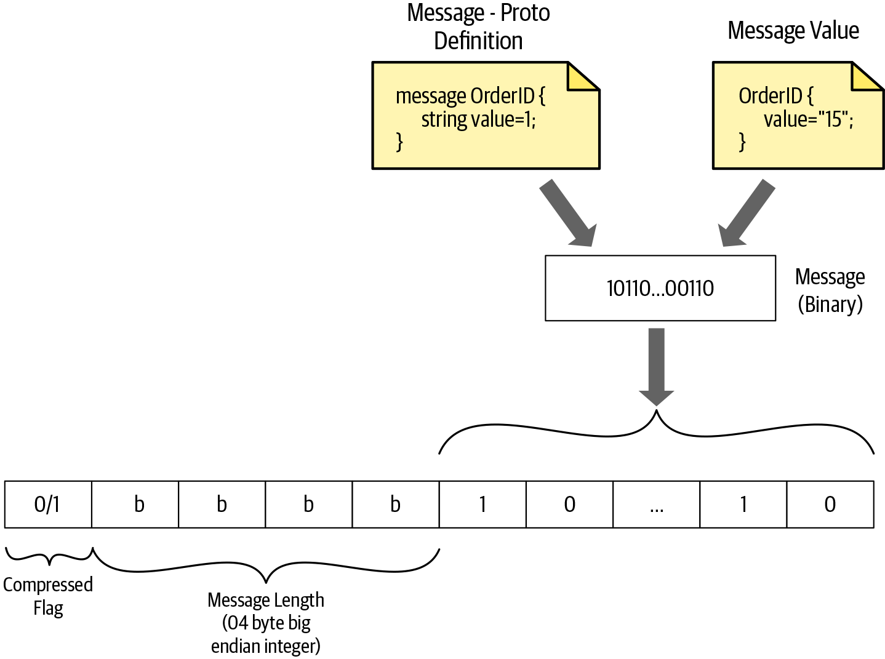
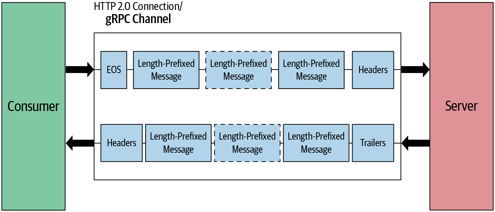

# gRPC 동작 원리

## RPC 흐름

- RPC 시스템에서 서버는 원격으로 호출되는 기능을 구현한다
- 클라이언트 애플리케이션은 서버에서 제공하는 동일한 함수에 대해 추상화를 제공하는 스텁을 생성해 클라이언트 애플리케이션이 서버 애플리케이션의 원격 함수를 호출하는 스텁 함수를 직접 호출한다.

#### 클라이언트

1. 프로시저 호출
2. 스텁이 인코딩 메시지로 요청 생성

#### 네트워크

3. 메시지 전송

#### 서버

4. 메시지 헤더 검사 후 서버 스텁에 메시지 전달
5. 스텁은 메시지 바이트를 언어별 데이터 구조로 복원
6. 스텁은 함수를 로컬로 호출
7. 서비스 함수의 응답이 인코딩된 후 클라이언트로 다시 전송

#### gRPC 와 RPC 차이점

- 메시지 인코딩 방식
- gRPC는 프로토콜 버퍼 사용
- 프로토콜 버퍼는 구조화된 데이터를 직렬화 하기 위한 언어에 제한되지 않고 플랫폼 중립적이며 확장 가능한 매커니즘을 가짐

## 프로토콜 버퍼를 사용한 메시지 인코딩

![4. gRPC: Under the Hood - gRPC: Up and Running [Book]](README.assets/grpc_0402.png)

- 태그는 필드 인덱스와 wire type 의 두가지 값으로 구성된다. 
- 필드 인덱스는 프로토 파일에서 메시지를 정의할 때 각 메시지 필드에 할당된 고유 번호이다 


#### 태그 값 구조

```
Tag value = (field_index << 3) | wire_type
```

필드 인덱스 + 와이어 타입 (3비트)


- 프로토콜 버퍼틑 문자열을 UTF-8을 사용해 값을 인코딩하고 int32 필드 타입인 정수값은 가변 길이 정수라는 인코딩 기술을 사용한다 
- 메시지가 인코딩되면 태그와 같이 바이트 스트림으로 연결된다
- 스트림 끝은 0이라는 태그 값을 전송해 표시한다 


### 인코딩 기술

메시지 정의를 설계할 대 각 데이터 유형에서 데이터가 인코딩되는 방법은 중요하다 

메시지가 런타임에 효율적으로 인코딩되도록 각 메시지 필드에 가장 적합한 데이터 타입으로 설정할 수 있기 때문이다 

#### 가변 길이 정수

하나 이상의 바이트를 사용해 정수를 직렬화하는 방법

대부분 숫자가 균등하게 분포돼 있지 않다는 점에 기반한다 

각 값에 할당된 바이트 수는 고정돼 있지 않고 값에 따라 다르다 

마지막 바이트를 제외한 바이트에 앞으로 더 많은 바이트가 있음을 나타내기 위해 최상휘 비트 Most Significnat Bit 가 1이 된다 

각 바이트의 하위 7비트는 해당 수에 대한 2의 보수 표현으로 저장되며 최하위 비트 least significant bit 가 먼저 나오기 땜문에 하위 그룹 low-order group 에 연속 비트를 추가해야 한다. (121쪽 옮긴이의 메모 참조 필요)

#### 부호 있는 정수

양수와 음수를 모두 갖는 타입으로 `sint32` , `sint64` 같은 필드 타입이 부호 있는 정수로 간주된다.

부호 있는 타입의 경우 zigzag 인코딩이 부호 있는 정수를 부호 없는 정수로 변환하는데 사용된다

변환한 다음에는 부호 없는 정수는 가변 길이 정수 인코딩 방법을 사용해 인코딩 한다 

  int32나 int64와 같은 일반 타입은 음수가 가변 길이 인코딩을 사용해 바이너리로 변환된다

음의 정수는 sint32나 sint64와 같은 부호 있는 정수 타입을 사용하는 것이 좋다 

음의 정수에 대한 가변 길이 정수 인코딩은 양의 정수보다 같은 바이너리 값을 나타내고자 더 많은 바이트가 필요하다 

#### 비가변 길이 정수 숫자

- 실제 값에 관계없이 고정된 바이트 수를 할당한다 

#### 문자열 타입

프로토콜 버퍼에서 문자열 타입은 길이로 구분된 와이어 타입에 속한다. 

지정된 바이트 수의 데이터가 뒤따르는 가변 길이 정수 인코딩 크기를 갖는다 

문자열은 UTF-8 문자 인코딩을 사용해 인코딩된다 

### 길이-접두사 지정 메시지 프레이밍

메시징 프레이밍 방식은 의도한 대상이 정보를 쉽게 추출할 수 있도록 관련 정보와 커뮤니케이션을 구성하는 것이다 

gRPC 통신에도 적용된다 

전송 인코딩 데이터가 있으면 정보를 추출할 수 있는 방식으로 데이터를 패키징해야 한다

길이-접두사 지정 빙식은 메시지 자체를 전송하기 전 각 메시지 크기를 기록하는 메시지 프레이밍 방식이다 

메시지 크기는 유한하며 메시지 크기를 나타내고자 4바이트를 할당하기에 gRPC 통신은 최대 4GB 크기의 모든 메시지를 처리할 수 있다 

 

### HTTP/2를 통항 gRPC

#### HTTP/2

클라이언트와 서버 간의 모든 통신은 단일 TCP 연결을 통해 처리되며, 이는 임의의 크기의 양방향 바이트 흐름을 전달할 수 있다. 

- 스트림: 설정된 연결에서의 양방향 바이트 흐름이며 스트림은 하나 이상의 메시지를 전달할 수 있다 
- 프레임: HTTP/2에서 가장 작은 통신 단위로, 각 프레임에는 프레임 헤더가 포함돼 있으며 헤더를 통해 프레임이 속한 스트림을 식별한다.

- 메시지: 하나 이상의 프레임으로 구성된 논리적 HTTP 메시지에 매핑되는 온전한 프레임 시퀀시이다. 클라이언트와 서버가 메시지를 독립 프레임으로 분류하고 interleave 한 후 다른 쪽으로 다시 조립할 수 있는 메시지 멀티플렉스를 지원한다 
- 작은 단위로부터 프레임 -> 메시지 -> 스트림이다 


gRPC 채널은 HTTP/2 연결인 엔드포인트에 대한 연결을 나타낸다. 

원격 호출은 HTTP/2 스트림으로 처리되며, 원격 호출로 전ㄱ송된 메시지는 HTTP/2 프레임으로 전송된다.


### 요청 메시지

원격 호출을 시작하는 메시지이다 

항상 클라이언트 애플리케이션에 의해 트리거되며 요청 헤더, 길이-접두사 지정 메시지, 스트림 종료 플래그라는 세 가지 주요 요소로 구성된다. 

클라이언트가 요청 헤더를 보내면 원격 호출이 시작되고 길이-접두사 지정 메시지가 해당 호출로 전송된다. 마지막으로 스트림 종료 EOS 플래그가 전송돼 수신자에게 요청 메시지 전송이 완료 됐음을 알린다.


### 응답 메시지

응답 헤더, 길이-접두사 지정 메시지, 트레일러로 구성된다 

클라이언트에 응답으로 보낼 길이-접두사 지정 메시지가 없는 경우 응답 메시지는 헤더와 트레일러로만 구성된다 


## gRPC 통신 패턴에서의 메시지 흐름 이해

### 단순 RPC


요청 메시지에는 헤더와 하나 이상의 데이터 프레임에 걸쳐 있을 수 있는 길이-접두사 지정 메시지가 포함된다

`half-close the connection` 연결 절반 종료는 클라이언트에서 연결을 닫아 더이상 서버로 메시지를 보낼 수 는 없지만 여전히 서버에서 들어오는 메시지는 수신될 수 있음을 의미한다 

서버는 전체 메시지를 받은 후에 응답하는데 응답 메시지에는 헤더 프레임과 길이-접두사 지정 메시지가 포함된다

서버가 상태 정보와 트레일러 헤더를 보내면 통신이 종료된다 

### 서버 스트리밍 RPC

서버는 한 응답 메시지를 클라이언트에 보내지 않고 여러 메시지를 보낸다 


### 클라이언트 스트리밍 RPC

클라이언트 스트리밍 RPC에서는 클라이언트가 여러 메시지를 서버로 보내고 서버는 응답으로 한 응답 메시지만을 보낸다. 클라이언트는 먼저 헤더 프레임을 전송해 서버와의 연결을 설정한다. 최종적으로 클라이언트는 마지막 데이터 프레임에 EOS 플래그를 전송해 연결 절반을 닫는다. 그러는 동안 서버는 클라이언트에서 받은 메시지를 읽는다.

모든 메시지를 받으면 서버는 후행 헤더와 함께 응답 메시지를 보내므로 연결을 닫는다 


1. 클라이언트는 헤더 프레임을 전송해 서버와의 연결을 설정한다 
2. 클라이언트는 마지막 데이터 프레임에 EOS 플래그를 전송해 연결 절반을 닫는다 


### 양방향 스트리밍 RPC

1. 클라이언트가 헤더 프레임을 전송해 연결을 설정한다 
2. 연결이 설정 되면 클라이언트와 서버는 모두 상대방이 끝나기를 기다리지 않고 길이-접두사 지정 메시지를 보낸다.




### gRPC 구현 아키텍처 

gRPC 구현은 여러 레이어로 구성되고, 기본 레이어는 gRPC 코어 레이어다. 

레이어는 얇은 층으로 상위 레이어의 모든 네트워크 작업을 추상화해 애플리케이션 개발자가 네트워크를 통해 RPC 호출을 쉽게 수행할 수 있게 한다. 

코어 레이어는 핵심 기능의 확장을 제공한다.

일부 확장 포인트는 통신 보안용 인증 필터와 통신 타임아웃을 구현하는 데드라인 필터 등이다 

애플리케이션 코드는 언어 바인딩 위에 구현된다 

애플리케이션 레이어는 애플리케이션 로직과 데이터 인코딩 로직을 처리한다. 

일반적으로 개발자는 개별 언어에서 제공하는 컴파일러를 사용해 데이터 인코딩 로직에 대한 소스코드를 생성한다 


