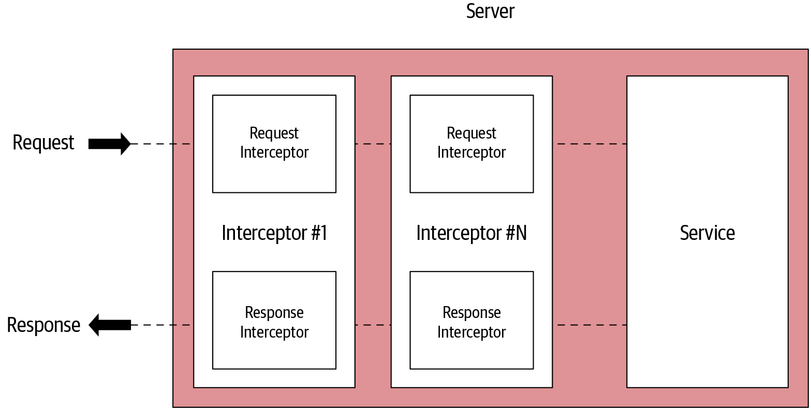
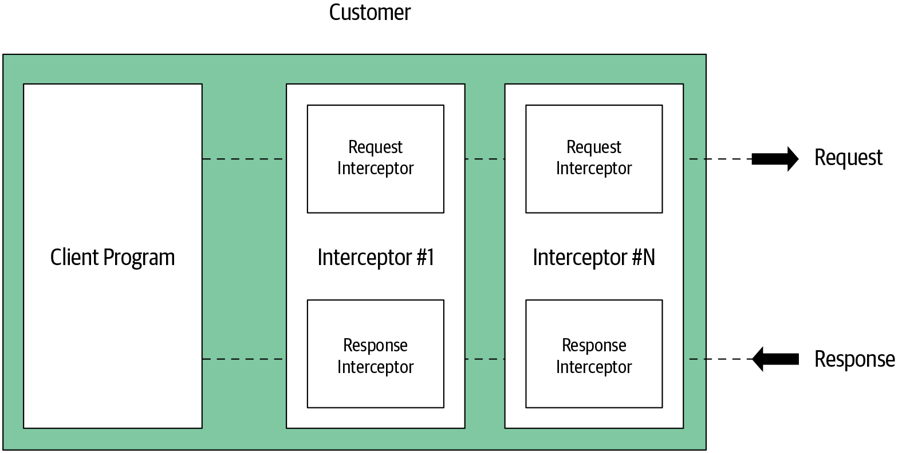
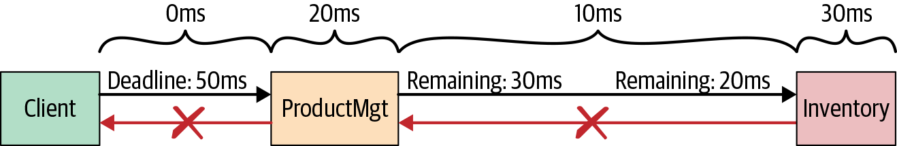
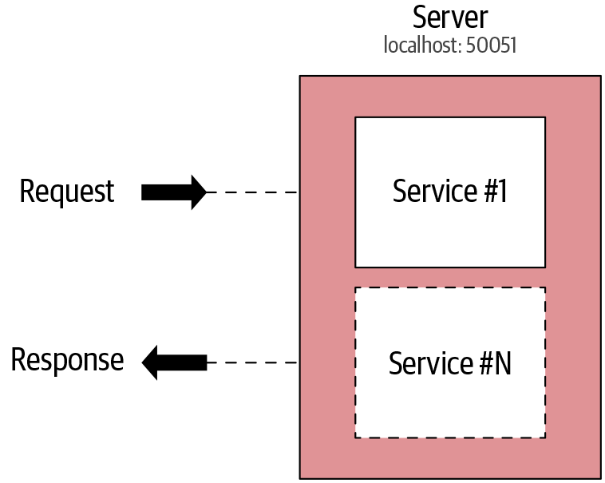
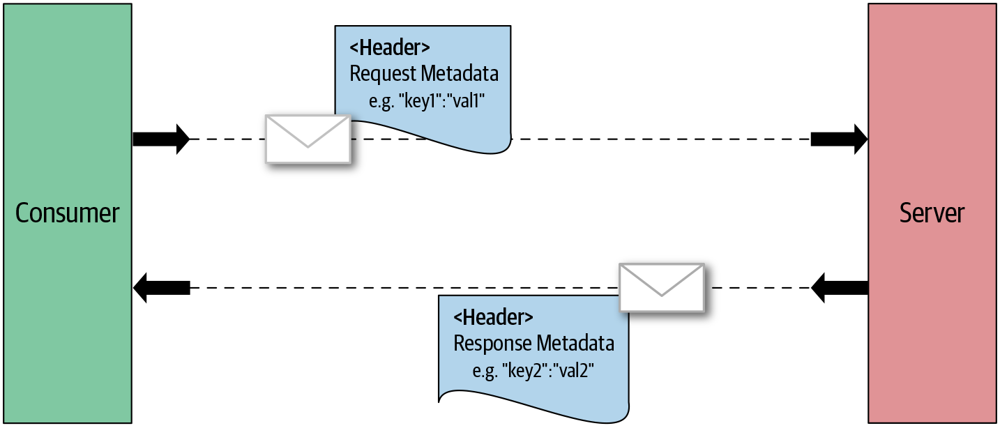
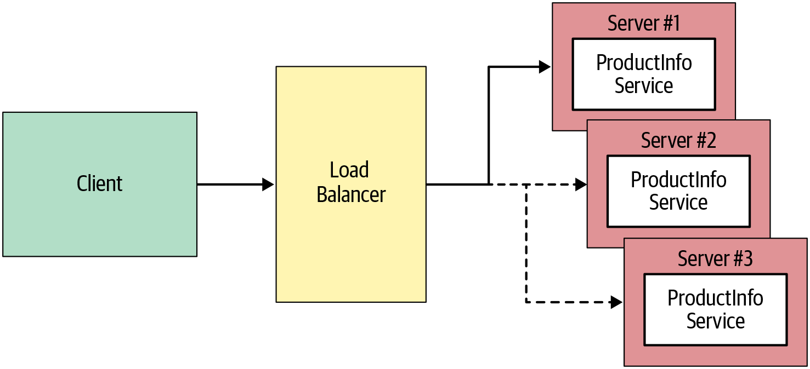
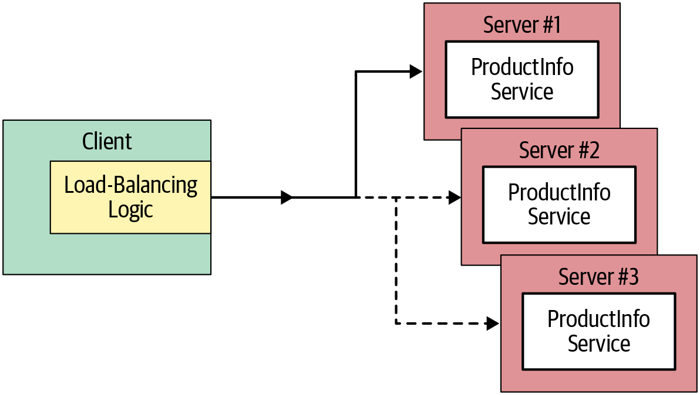
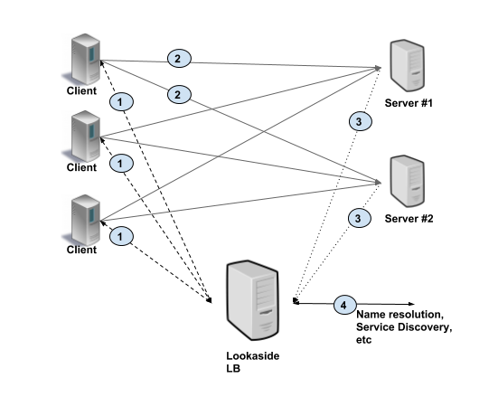

# 고급 기능

## 인터셉터

인터셉터라는 확장 메커니즘을 사용해 로깅, 인증, 매트릭 등과 같은 특정 요구 사항 충족을 위해 RPC 실행을 가로채거나 클라이언트와 서버 gRPC 애플리케이션에서 인터셉터를 구현하고 설치하기 위한 간단한 API를 제공한다 

### 서버 측 인터셉터 

클라이언트가 gRPC 서비스의 원격 메서드를 호출할 때 서버에서 인터셉터를 사용해 원격 메서드 실행 전에 공통 로직을 실행 할 수 있다 

원격 메서드를 호출 하기 전에 인증과 같은 특정 기능을 적용해야 할 때 필요하다 



#### 단일 인터셉터

서버에서 gRPC 서비스의 단일 RPC 가로채려면 gRPC 서버에 단일 인터셉터를 구현해야 한다.

```go
func orderUnaryServerInterceptor(ctx context.Context, req interface{}, 
                                 info *grpc.UnaryServerInfo, handler grpc.UnaryHandler) (interface{}, error) {
    // 전처리 로직
    // 인자로 넘겨진 info 를 통해 현재 RPC 호출에 대한 정보를 얻는다 
    log.Println(info.FullMethod)
    
    // 단일 RPC 의 정상 실행을 완료하고자 핸들러를 호출한다 
    m, err := handler(ctx, req)
    
    // 후처리 로직
    log.Printf("Post Proc Message : %s", m)
    
    return m, err
}

func main() {
    s := grpc.NewServer(
        grpc.UnaryInterceptor(orderUnaryServerInterceptor)
    )
}
```

1. 전처리
2. RPC 메서드 호출
3. 후처리 


#### 스트리밍 인터셉터

grpc 서버가 처리하는 모든 스트리밍 RPC 호출을 인터셉트한다 

스트리밍 인터셉터는 전처리 단계와 스트림 동작 인터셉트 단계를 포함한다 

```go
func(srv interface{}, ss ServerStream, info *StreamServerInfo, handler StreamHandler) error
```

```go
type wrappedStream struct {
    grpc.ServerStream
}

func (w *wrappedStream) RecvMsg(m interfdace{}) error {
    return w.ServerStream.RecvMsg(m)
}

func (w *wrappedStream) SendMsg(m interface{}) error {
    return w.ServerStream.SendMsg(m)
}

func newWrappedStream(s grpc.ServerStream) grpc.ServerStream {
    return &wrappedStream{s}
}

func orderServerStreamInterceptor(srv interface{}, ss grpc.ServerStream, info *grpc.StreamServerInfo,
                                  handler grpc.StreamHandler) error {
    err := handler(srv, newWrappedStream(ss))
    if err != nil {
        log.Printf("RPC failed with error %v", err)
    }
    return err 
}

s := grpc.NewServer(
    grpc.StreamInterceptor(orderServerStreamInterceptor)
)
```

### 

### 클라이언트 측 인터셉터

클라이언트가 gRPC 서비스의 원격 메서드를 호출하고자 RPC를 할 때 클라이언트에서 해당 RPC 호출을 가로챌 수 있다 




#### 단일 인터셉터

```go
func(ctx context.Context, method string, req, reply interface{},
         cc *ClientConn, invoker UnaryInvoker, opts ...CallOption) error
```

```go
func orderUnaryClientInterceptor(
	ctx context.Context, method string, req, reply interface{},
	cc *grpc.ClientConn,
	invoker grpc.UnaryInvoker, opts ...grpc.CallOption) error {
	// Preprocessor phase 전처리 단계
	log.Println("Method : " + method) 

	// Invoking the remote method 원격 메서드 호출
	err := invoker(ctx, method, req, reply, cc, opts...) 

	// Postprocessor phase 후처리 단계
	log.Println(reply) 

	return err 
}
...

func main() {
	// Setting up a connection to the server.
    // 서버로의 연결을 설정한다
	conn, err := grpc.Dial(address, grpc.WithInsecure(),
		grpc.WithUnaryInterceptor(orderUnaryClientInterceptor)) 
...
```


#### 스트리밍 인터셉터

클라이언트 측 스트리밍 인터셉터는 gRPC 클라이언트가 처리하는 모든 스트리밍 RPC 호출을 인터셉트하며 구현은 서버 측 구현과 매우 유사하다

```go
func(ctx context.Context, desc *StreamDesc, cc *ClientConn,
                                      method string, streamer Streamer,
                                      opts ...CallOption) (ClientStream, error)
```

```go
func clientStreamInterceptor(
	ctx context.Context, desc *grpc.StreamDesc,
	cc *grpc.ClientConn, method string,
	streamer grpc.Streamer, opts ...grpc.CallOption)
        (grpc.ClientStream, error) {
	log.Println("======= [Client Interceptor] ", method) 
	s, err := streamer(ctx, desc, cc, method, opts...) 
	if err != nil {
		return nil, err
	}
	return newWrappedStream(s), nil 
}


type wrappedStream struct { 
	grpc.ClientStream
}

func (w *wrappedStream) RecvMsg(m interface{}) error { 
	return w.ClientStream.RecvMsg(m)
}

func (w *wrappedStream) SendMsg(m interface{}) error { 
	return w.ClientStream.SendMsg(m)
}

func newWrappedStream(s grpc.ClientStream) grpc.ClientStream {
	return &wrappedStream{s}
}

...

func main() {
	// Setting up a connection to the server.
	conn, err := grpc.Dial(address, grpc.WithInsecure(),
		grpc.WithStreamInterceptor(clientStreamInterceptor)) 
...
```


### 데드라인

데드라인과 타임아웃은 분산 컴퓨팅에서 일반적으로 사용되는 패턴이다 

타임아웃은 클라이언트 애플리케이션이 RPC가 완료될 때까지 에러와 함께 끝나기 전에 얼마나 기다리는지를 지정한다 

일반적으로는 기간으로 지정되며 각 클라이언트에 개별로 적용된다 

하나의 요청이 하나 이상의 서비스를 함께 묶는 여러 다운스트림 RPC로 구성되는 예시는 각 서비스 호출 마다 개별 RPC 를 기준으로 타임아웃을 적용할 수 있지만, 요청 전체 수명 주기에는 직접 적용할 수 없다 -> 데드라인 사용


데드라인은 요청 시작 기준으로 특정시간으로 표현되며 여러 서비스 호출에 걸쳐 적용된다 

요청을 시작하는 애플리케이션이 데드라인을 설정하면 전체 요청 체인은 데드라인까지 응답해야 한다 

gRPC 통신은 네트워크를 통해 이뤄지므로 RPC 호출과 응답 사이 지연이 발생될 수 있다 

gRPC 서비스 자체 비즈니스 로직에 따라 응답하는데 더 많은 시간이 걸릴 수 있다 

데드라인을 사용하지 않고 클라이언트 애플리케이션을 개발하면 시작된 RPC 요청에 대한 응답을 무한정 기다르며 모든 진행 중인 요청에 대해 리소스가 계속 유지된다 

서비스는 물론 클라이언트도 리소스가 부족해질 수 있으므로 서비스 대기 시간이 길어지게 되며 결국 전체 gRPC 서비스가 중단될 수도 있다 



```go
conn, err := grpc.Dial(address, grpc.WithInsecure())
if err != nil {
    log.Fatalf("did not connect: %v", err)
}
defer conn.Close()
client := pb.NewOrderManagementClient(conn)

clientDeadline := time.Now().Add(
    time.Duration(2 * time.Second))
ctx, cancel := context.WithDeadline(
    context.Background(), clientDeadline) 1

defer cancel()

// Add Order
order1 := pb.Order{Id: "101",
    Items:[]string{"iPhone XS", "Mac Book Pro"},
    Destination:"San Jose, CA",
    Price:2300.00}
res, addErr := client.AddOrder(ctx, &order1) 2

if addErr != nil {
    got := status.Code(addErr) 3
    log.Printf("Error Occured -> addOrder : , %v:", got) 4
} else {
    log.Print("AddOrder Response -> ", res.Value)
}
```


### 취소 처리 

클라이언트와 서버 애플리케이션 사이의 gRPC 연결에서 클라이언트와 서버는 모두 통신 성공 여부를 독립적이고 개별적으로 결정한다

#### gRPC 취소 처리

```go
ctx, cancel := context.WithTimeout(context.Background(), 10*time.Second) 1


streamProcOrder, _ := client.ProcessOrders(ctx) 2
_ = streamProcOrder.Send(&wrapper.StringValue{Value:"102"}) 3
_ = streamProcOrder.Send(&wrapper.StringValue{Value:"103"})
_ = streamProcOrder.Send(&wrapper.StringValue{Value:"104"})

channel := make(chan bool, 1)

go asncClientBidirectionalRPC(streamProcOrder, channel)
time.Sleep(time.Millisecond * 1000)

// Canceling the RPC
cancel() 4
log.Printf("RPC Status : %s", ctx.Err()) 5

_ = streamProcOrder.Send(&wrapper.StringValue{Value:"101"})
_ = streamProcOrder.CloseSend()

<- channel

func asncClientBidirectionalRPC (
    streamProcOrder pb.OrderManagement_ProcessOrdersClient, c chan bool) {
...
		combinedShipment, errProcOrder := streamProcOrder.Recv()
		if errProcOrder != nil {
			log.Printf("Error Receiving messages %v", errProcOrder) 6
...
}
```


### 에러 처리

gRPC 를 호출하면 클라이언트는 성공 산태의 응답을 받거나 에러 상태를 갖는 에러를 받는다 

클라이언트 애플리케이션은 발생 가능한 모든 에러와 에러 상태를 처리하는 방식으로 작성해야 한다 

에러가 발생하면 gRPC 는 에러 상태의 자세한 정보를 제공하는 선택적 에러 메시지와 함께 에러 상태 코드를 반환한다 

상태 객체는 다른 언어에 대한 모든  gRPC 구현에 공통적인 정수 코드와 문자열 메시지로 구성된다 

[상태 코드](https://learning.oreilly.com/library/view/grpc-up-and/9781492058328/ch05.html#idm46536639832888)

#### 서버에서의 에러 생성과 전파

```go
if orderReq.Id == "-1" { 1
    log.Printf("Order ID is invalid! -> Received Order ID %s",
        orderReq.Id)

    errorStatus := status.New(codes.InvalidArgument,
        "Invalid information received") 2
    ds, err := errorStatus.WithDetails( 3
        &epb.BadRequest_FieldViolation{
            Field:"ID",
            Description: fmt.Sprintf(
                "Order ID received is not valid %s : %s",
                orderReq.Id, orderReq.Description),
        },
    )
    if err != nil {
        return nil, errorStatus.Err()
    }

    return nil, ds.Err() 4
    }
    ...
```

#### 클라이언트에서의 에러 처리

```go
order1 := pb.Order{Id: "-1",
	Items:[]string{"iPhone XS", "Mac Book Pro"},
	Destination:"San Jose, CA", Price:2300.00} 1
res, addOrderError := client.AddOrder(ctx, &order1) 2


if addOrderError != nil {
	errorCode := status.Code(addOrderError) 3
	if errorCode == codes.InvalidArgument { 4
		log.Printf("Invalid Argument Error : %s", errorCode)
		errorStatus := status.Convert(addOrderError) 5
		for _, d := range errorStatus.Details() {
			switch info := d.(type) {
			case *epb.BadRequest_FieldViolation: 6
				log.Printf("Request Field Invalid: %s", info)
			default:
				log.Printf("Unexpected error type: %s", info)
			}
		}
	} else {
		log.Printf("Unhandled error : %s ", errorCode)
	}
} else {
	log.Print("AddOrder Response -> ", res.Value)
}
```

### 멀티플렉싱

gRPC를 사용하면 동일한 gRPC 서버에서 여러 gRPC 서비스를 실행할 수 있고 여러 gRPC 클라이언트 스텁에 동일한  gRPC 클라이언트 연결을 사용할 수 있다 



#### 동일한 grpc.Server 를 공유하는 두 개의  gRPC 서비스

```go
func main() {
	initSampleData()
	lis, err := net.Listen("tcp", port)
	if err != nil {
		log.Fatalf("failed to listen: %v", err)
	}
	grpcServer := grpc.NewServer() 1

	// Register Order Management service on gRPC orderMgtServer
	ordermgt_pb.RegisterOrderManagementServer(grpcServer, &orderMgtServer{}) 2

	// Register Greeter Service on gRPC orderMgtServer
	hello_pb.RegisterGreeterServer(grpcServer, &helloServer{}) 3

      ...
}
```

#### 동일한  grpc.ClientCon 을 공유하는 두 개의 gRPC 클라이언트 스텁

```go
// Setting up a connection to the server.
conn, err := grpc.Dial(address, grpc.WithInsecure()) 1
...

orderManagementClient := pb.NewOrderManagementClient(conn) 2

...

// Add Order RPC
	...
res, addErr := orderManagementClient.AddOrder(ctx, &order1)

...


helloClient := hwpb.NewGreeterClient(conn) 3

	...
	// Say hello RPC
helloResponse, err := helloClient.SayHello(hwcCtx,
	&hwpb.HelloRequest{Name: "gRPC Up and Running!"})
...
```


### 메타데이터 

gRPC 애플리케이션은  gRPC 서비스와 소비자 사이의 RPC 호출을 통해 정보를 공유한다 

서비스의 비즈니스 로직 및 소비자와 직접 관련된 정보는 원격 메서드 호출 인자의 일부다 

특정 조건에서 RPC 비즈니스 콘텍스트와 관련 없는 RPC 호출 정보를 공유할 수 있는데 RPC 안자의 일부가 되어서는 안된다 

gRPC 서비스나 gRPC 클라이언트에서 보내거나 받을 수 있는 gRPC 메타데이터를 사용할 수 있다 


RPC 헤더를 사용해 클라이언트나 서버에서 생성한 메타데이터를 클라이언트와 서버 애플리케이션 간에 교환할 수 있다 

메타데이터는 키/값에 대한 목록 형식으로 구성된다 




메타데이터 사용은 gRPC 애플리메이션 간에 보안 헤더를 교환하는 것이다 

gRPC 애플리케이션 사이에 임의의 정보를 교환하는데도 사용할 수 있고 gRPC 메타데이터 API는 개발되는 인터셉터 내부에서 많이 사용된다 

#### 메타데이터 생성과 조회

```go
// Metadata Creation : option I
md := metadata.New(map[string]string{"key1": "val1", "key2": "val2"})

// Metadata Creation : option II
md := metadata.Pairs(
    "key1", "val1",
    "key1", "val1-2", // "key1" will have map value []string{"val1", "val1-2"}
    "key2", "val2",
)
```

바이너리 데이터를 메타데이터 값으로 설정할 수도 있는데

메타데이터로 설정한 바이너리 데이터는 전송 전에 base64로 인코딩되고 전송 후 다시 디코딩된다 

```go
func (s *server) AddOrder(ctx context.Context, orderReq *pb.Order)
    (*wrappers.StringValue, error) {

md, metadataAvailable := metadata.FromIncomingContext(ctx)
// read the required metadata from the ‘md’ metadata map.
```


#### 메타데이터 전송과 수신 // 클라이언트

```go
md := metadata.Pairs(
	"timestamp", time.Now().Format(time.StampNano),
	"kn", "vn",
) 1
mdCtx := metadata.NewOutgoingContext(context.Background(), md) 2

ctxA := metadata.AppendToOutgoingContext(mdCtx,
      "k1", "v1", "k1", "v2", "k2", "v3") 3

// make unary RPC
response, err := client.SomeRPC(ctxA, someRequest) 4

// or make streaming RPC
stream, err := client.SomeStreamingRPC(ctxA) 5
```

```go
var header, trailer metadata.MD 1

// ***** Unary RPC *****

r, err := client.SomeRPC( 2
    ctx,
    someRequest,
    grpc.Header(&header),
    grpc.Trailer(&trailer),
)

// process header and trailer map here.

// ***** Streaming RPC *****

stream, err := client.SomeStreamingRPC(ctx)

// retrieve header
header, err := stream.Header() 3

// retrieve trailer
trailer := stream.Trailer() 4

// process header and trailer map here.
```


#### 메타데이터 전송과 수신 // 서버

- 메타데이터 읽기

```go
func (s *server) SomeRPC(ctx context.Context,
    in *pb.someRequest) (*pb.someResponse, error) { 1
    md, ok := metadata.FromIncomingContext(ctx) 2
    // do something with metadata
}

func (s *server) SomeStreamingRPC(
    stream pb.Service_SomeStreamingRPCServer) error { 3
    md, ok := metadata.FromIncomingContext(stream.Context()) 4
    // do something with metadata
}
```

- 메타데이터 서버에서 전송

```go
func (s *server) SomeRPC(ctx context.Context,
    in *pb.someRequest) (*pb.someResponse, error) {
    // create and send header
    header := metadata.Pairs("header-key", "val")
    grpc.SendHeader(ctx, header) 1
    // create and set trailer
    trailer := metadata.Pairs("trailer-key", "val")
    grpc.SetTrailer(ctx, trailer) 2
}

func (s *server) SomeStreamingRPC(stream pb.Service_SomeStreamingRPCServer) error {
    // create and send header
    header := metadata.Pairs("header-key", "val")
    stream.SendHeader(header) 3
    // create and set trailer
    trailer := metadata.Pairs("trailer-key", "val")    stream.SetTrailer(trailer) 4
}
```


#### 네임 리졸버

서비스 이름에 대한 백엔드 IP 목록을 반환한다 

아래 리졸버는 1b.example.grpc.io 를 localhost:50051과 localhost:50052로 변환한다 

```go
type exampleResolverBuilder struct{} 1

func (*exampleResolverBuilder) Build(target resolver.Target,
	cc resolver.ClientConn,
	opts resolver.BuildOption) (resolver.Resolver, error) {

	r := &exampleResolver{ 2
		target: target,
		cc:     cc,
		addrsStore: map[string][]string{
           exampleServiceName: addrs, 3
		},
	}
	r.start()
	return r, nil
}
func (*exampleResolverBuilder) Scheme() string { return exampleScheme } 4

type exampleResolver struct { 5
	target     resolver.Target
	cc         resolver.ClientConn
	addrsStore map[string][]string
}

func (r *exampleResolver) start() {
	addrStrs := r.addrsStore[r.target.Endpoint]
	addrs := make([]resolver.Address, len(addrStrs))
	for i, s := range addrStrs {
		addrs[i] = resolver.Address{Addr: s}
	}
	r.cc.UpdateState(resolver.State{Addresses: addrs})
}
func (*exampleResolver) ResolveNow(o resolver.ResolveNowOption) {}
func (*exampleResolver) Close()                                 {}

func init() {
	resolver.Register(&exampleResolverBuilder{})
}
```

네임 리졸버 구현은 consul, etcd, zookeeper 같은 모든 서비스 레지스트리에 대해 리졸버를 구현할 수 있다 

gRPC 로드밸런싱 요구 사항은 사용되는 배포 패턴이나 적용 사례에 따라 달라진다 

쿠버네티스와 같은 컨테이너 오케스트레이션 플랫폼이나 서비스 메시 같은 더 높은 추상화 채택이 증가함에 따라 클라이언트 측에서 로드밸런싱 로직을 직접 구현해야 하는 경우는 매우 드물다 


### 로드 밸런싱

[gRPC 공식문서 로드 밸런서](https://grpc.io/blog/grpc-load-balancing/)

- 상품 수준 gRPC 애플리케이션을 개발할 때는 애플리케이션이 고가용성과 확장성 요구를 충족시킬 수 있게 해야 한다.
- 실제 서비스 환경에서 항상 둘 이상의 gRPC 서버를 실행해야 하는 것이다 
- 서비스들 사이에 RPC 호출을 분산시키려면 일부 엔티티에서 처리해야 한다 
- gRPC 에서는 로드밸런서 프록시 load-balancer proxy, LB proxy 와 클라이언트 측 로드밸런싱 client-side load balancing 이라는 두가지 주요 로드밸런싱 매커니즘이 사용된다 

#### 로드밸런서 프록시

1. 클라이언트가 LB 프록시에 RPC 를 요청한다 

2. LB 프록시는 호출을 처리하는 실제 로직을 구현한 사용 가능한 백엔드 gRPC 서버 중 하나에게 RPC 호출을 분배한다 
3. LB 프록시는 각 백엔드 서버의 로드 load 를 추적하고 백엔드 서비스 간에 로드를 분배하기 위한 다양한 로드밸런싱 알고리즘을 제공한다 




백엔드 서비스의 토폴로지 topology (망구성방식) 는 gRPC 클라이언트에 공개되지 않으며 클라이언트는 로드밸런서의 엔드포인트만 알고 있다 

클라이언트에서는 로드밸런서의 엔드포인트를 모든 gRPC 연결로 사용하는것 외에는 로드밸런싱 사용 사례에 맞게 변경될 필요는 없다 

백엔드 서비스는 로드밸런싱 로직에 해당 정보를 사용할 수 있도록 로드 상태를 로드밸런서에 다시 알릴 수 있다 

Nginx, Emvoy proxy 등과 같은 로드밸런싱 솔루션을 gRPC 애플리케이션의 LB 프록시로 사용할 수 있다 


#### 클라이언트 측 로드밸런싱

로드밸런싱을 위한 별도의 중간 프록시 계층을 갖는 대신 gRPC 클라이언트 레벨에서 로드밸런싱 로직을 구현할 수 있다 

클라이언트는 여러 백엔드 gRPC 서버를 인식하고 각 RPC에 사용할 한 서버를 선택한다 



로드밸런싱 로직은 클라이언트 애플리케이션의 일부로 개발되거나 룩어사이드 lookaside 로드밸런서라고 하는 전용 서버에서 구현될 수 있다



클라이언트는 연결할 최상의 gRPC 서버를 얻고자 질의 query 할 수 있고 클라이언트는 룩어사이드 로드밸런서에서 얻은  gRPC 서버 주소에 직접 연결한다 

- 씩 클라이언트를 통한 클라이언트 측 로드밸런싱

> Thick Client
>
> 씩 클라이언트 접근 방식은 부하 분산 스마트가 클라이언트에서 구현된다는 것을 의미합니다. 클라이언트는 사용 가능한 서버, 작업량 및 서버 선택에 사용되는 알고리즘을 추적할 책임이 있습니다. 클라이언트는 일반적으로 서비스 검색, 이름 결정, 할당량 관리 등과 같은 다른 인프라와 통신하는 라이브러리를 통합합니다.

```go
pickfirstConn, err := grpc.Dial(
		fmt.Sprintf("%s:///%s",
        // 	exampleScheme      = "example"
        //	exampleServiceName = "lb.example.grpc.io"
        exampleScheme, exampleServiceName), 1
        // "pick_first" is the default option. 2
		grpc.WithBalancerName("pick_first"),

		grpc.WithInsecure(),)
if err != nil {
    log.Fatalf("did not connect: %v", err)
}
defer pickfirstConn.Close()

log.Println("==== Calling helloworld.Greeter/SayHello " +
	"with pick_first ====")
makeRPCs(pickfirstConn, 10)

// Make another ClientConn with round_robin policy.
roundrobinConn, err := grpc.Dial(
    fmt.Sprintf("%s:///%s", exampleScheme, exampleServiceName),
    // "example:///lb.example.grpc.io"
    grpc.WithBalancerName("round_robin"), 3
    grpc.WithInsecure(),
)
if err != nil {
    log.Fatalf("did not connect: %v", err)
}
defer roundrobinConn.Close()

log.Println("==== Calling helloworld.Greeter/SayHello " +
	"with round_robin ====")
makeRPCs(roundrobinConn, 10)
```


### 압축

- 네트워크 대역폭을 효율적으로 사용하기 위해 클라이언트와 서비스 사이에서 RPC 가 실행될 때 압축을 사용할 수 있다 
- 클라이언트에서 gRPC 압축 사용은 RPC 수행할 때 압축기 compressor 를 설정해 구현한다 

```go
client.AddOrder(ctx, &order1, grpc.UseCompressor(gzip.Name))
```

서버에서는 등록된 압축기가 자동으로 요청 메시지를 디코딩하고 응답을 인코딩한다 

서버는 항상 클라이언트가 지정한 것과 동일한 방법을 사용해 응답하는데 해당 압축기가 등록되지 않은 경우 Unimplemented 상태가 클라이언트로 반환된다 

