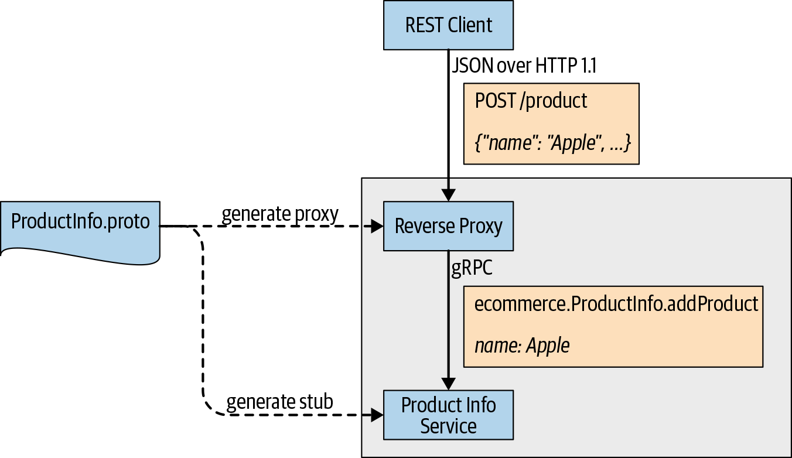
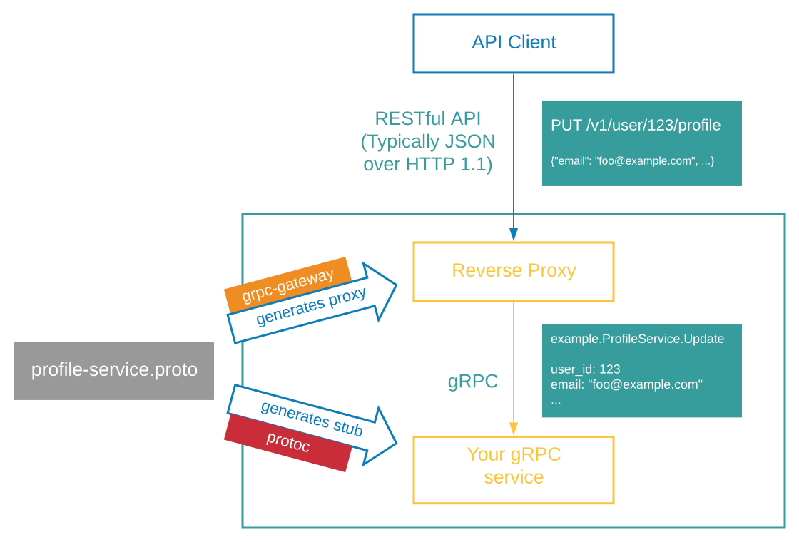
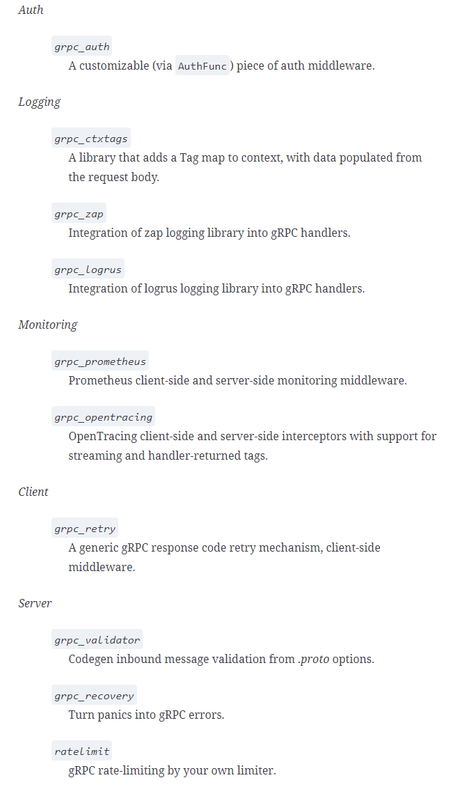

# gRPC 생태계

## gRPC 게이트웨이

gRPC 게이트웨이 플러그인을 사용하면 프로토콜 버퍼 컴파일러가 gRPC 서비스 정의를 읽고 리버스 프록시 서버를 생성하는데, 이 서버는 RESTful JSON API를 gRPC 로 변환한다 





```protobuf
syntax = "proto3";

import "google/protobuf/wrappers.proto";
import "google/api/annotations.proto"; 1

package ecommerce;

service ProductInfo {
   rpc addProduct(Product) returns (google.protobuf.StringValue) {
       option (google.api.http) = { 2
           post: "/v1/product"
           body: "*"
       };
   }
   rpc getProduct(google.protobuf.StringValue) returns (Product) {
        option (google.api.http) = { 3
            get:"/v1/product/{value}"
        };
   }
}

message Product {
   string id = 1;
   string name = 2;
   string description = 3;
   float price = 4;
}
```

```bash
$ go install \
    github.com/grpc-ecosystem/grpc-gateway/v2/protoc-gen-grpc-gateway \
    github.com/grpc-ecosystem/grpc-gateway/v2/protoc-gen-openapiv2 \
    google.golang.org/protobuf/cmd/protoc-gen-go \
    google.golang.org/grpc/cmd/protoc-gen-go-grpc
```

<div align="center">
<a href="https://www.youtube.com/watch?v=Pq1paKC-fXk">

</a>
</div>

```bash
protoc -I/usr/local/include -I. \
-I$GOPATH/src \
-I$GOPATH/src/github.com/grpc-ecosystem/grpc-gateway/third_party/googleapis \
--go_out=plugins=grpc:. \
product_info.proto
```
#### Go 언어 HTTP 리버스 프록시

```go
package main

import (
  "context"
  "log"
  "net/http"

  "github.com/grpc-ecosystem/grpc-gateway/runtime"
  "google.golang.org/grpc"

  gw "github.com/grpc-up-and-running/samples/ch08/grpc-gateway/go/gw" 1
)

var (
  grpcServerEndpoint = "localhost:50051" 2
)

func main() {
  ctx := context.Background()
  ctx, cancel := context.WithCancel(ctx)
  defer cancel()

  mux := runtime.NewServeMux()
  opts := []grpc.DialOption{grpc.WithInsecure()}
  err := gw.RegisterProductInfoHandlerFromEndpoint(ctx, mux,
      grpcServerEndpoint, opts) 3
  if err != nil {
     log.Fatalf("Fail to register gRPC gateway service endpoint: %v", err)
  }

  if err := http.ListenAndServe(":8081", mux); err != nil { 4
     log.Fatalf("Could not setup HTTP endpoint: %v", err)
  }
}
```


## gRPC 를 위한 HTTP/JSON 트랜스 코딩

트랜스코딩은 HTTP JSON 호출을 RPC 호출로 변환하고 gRPC 서비스에 전달하는 프로세스이다

클라이언트 애플리케이션이 gRPC를 지원하지 않고 HTTP 기반 JSON 을 통해 gRPC 서비스와 통신할 수 있는 액세스를 제공해야 할 때 유용하다 

``` protobuf
   rpc getProduct(google.protobuf.StringValue) returns (Product) {
        option (google.api.http) = {
            get:"/v1/product/{value}"
        };
   }
```


## gRPC 서버 리플렉션 프로토콜

서버 리플렉션 server reflection 은 gRPC 서버에서 정의된 서비스로 해당 서버에서 공개적으로 액세스 가능한 gRPC 서비스의 정보를 제공한다 

서버 리플렉션은 서버에 등록된 서비스의 서비스 정의를 클라이언트 애플리케이션에 제공하는 것이다 

클라이언트는 서비스와 통신하고자 미리 컴파일된 서비스 정의가 필요하지 않다 


서버 리플레션은 gRPC 서버를 디버깅하기 위한 명령 CLI 도구를 작성할 때 유용하다 

서비스 정의를 제공할 필요는 없지만 대신 메서드와 텍스트 페이로드를 제공한다 

바이너리 페이로드를 서버로 전송하고 응답을 사람이 읽을 수 있는 형식으로 사용자에게 다시 가져온다 

#### gRPC Go 서버에서 서버 리플렉션 활성화

```go
package main

import (
  ...

  pb "productinfo/server/ecommerce"
  "google.golang.org/grpc"
  "google.golang.org/grpc/reflection" 
)

func main() {
  lis, err := net.Listen("tcp", port)
  if err != nil {
     log.Fatalf("failed to listen: %v", err)
  }
  s := grpc.NewServer()
  pb.RegisterProductInfoServer(s, &server{})
  reflection.Register(s) 
  if err := s.Serve(lis); err != nil {
     log.Fatalf("failed to serve: %v", err)
  }
}
```


## gRPC 미들웨어 

분산 시스템의 소프트웨어 구성요소로 클라이언트가 생성한 요청을 백엔드 서버로 라우팅하고자 다른 구성 요소를 연결하는데 사용된다 

인터셉터 개념을 기반으로 하며 gRPC  기반 애플리케이션을 빌드할 때 필요한 인터셉터, 헬퍼, 유틸리티의 Go 기반 모음이다 

클라이언트나 서버 측에서 여러 인터셉터를 인터셉터 체인으로 적용할 수 있다 

#### go grpc 미들웨어를 사용하는 서버 측 인터셉터 체인

```go
import "github.com/grpc-ecosystem/go-grpc-middleware"

orderMgtServer := grpc.NewServer(
    grpc.Unaryinterceptor(grpc_middleware.ChainUnaryServer( 1
        grpc_ctxtags.UnaryServerinterceptor(),
        grpc_opentracing.UnaryServerinterceptor(),
        grpc_prometheus.UnaryServerinterceptor,
        grpc_zap.UnaryServerinterceptor(zapLogger),
        grpc_auth.UnaryServerinterceptor(myAuthFunction),
        grpc_recovery.UnaryServerinterceptor(),
    )),
    grpc.Streaminterceptor(grpc_middleware.ChainStreamServer( 2
        grpc_ctxtags.StreamServerinterceptor(),
        grpc_opentracing.StreamServerinterceptor(),
        grpc_prometheus.StreamServerinterceptor,
        grpc_zap.StreamServerinterceptor(zapLogger),
        grpc_auth.StreamServerinterceptor(myAuthFunction),
        grpc_recovery.StreamServerinterceptor(),
    )),
    )
```




 #### Go gRPC 미들웨어를 사용하는 서버 측 인터셉터 체인

```go
import "github.com/grpc-ecosystem/go-grpc-middleware"

clientConn, err = grpc.Dial(
   address,
     grpc.WithUnaryinterceptor(grpc_middleware.ChainUnaryClient(
          monitoringClientUnary, retryUnary)), 1
     grpc.WithStreaminterceptor(grpc_middleware.ChainStreamClient(
          monitoringClientStream, retryStream)), 2
)
```

- 클라이언트 측 단일 인터셉터 체인
- 클라이언트 측 스트리밍 인터셉터 체인

서버와 유사하게 인터셉터는 클라이언트에 등록된 순서대로 실행된다 


## 상태 확인 프로토콜

gRPC 는 gRPC 서비스가 서버 상태를 노출해 소비자가 서버 상태 정보를 조사할 수 있게 하는 상태 확인 프로토콜을 정의 한다 

Health Checking Protocol

Health Checking API

서버 상태는 서버가 RPC를 처리할 준비가 되지 않았거나 상태 probe 프로브 요청에 응답하지 않았을 때 비정상 상태로 응답하는지 판별한다 

응답이 비정상 상태를 나타내거나 일정 시간 내에 응답이 수신되지 않으면 클라이언트가 그에 따라 작동할 수 있다 

### 상태 확인 API의 gRPC 서비스 정의

```protobuf
syntax = "proto3";

package grpc.health.v1;

message HealthCheckRequest { 1
  string service = 1;
}

message HealthCheckResponse { 2
  enum ServingStatus {
    UNKNOWN = 0;
    SERVING = 1;
    NOT_SERVING = 2;
  }
  ServingStatus status = 1;
}

service Health {
  rpc Check(HealthCheckRequest) returns (HealthCheckResponse); 3

  rpc Watch(HealthCheckRequest) returns (stream HealthCheckResponse); 4
}
```

### 핵심 사항

- 서버에 등록된 각 서비스의 상태를 제공하려면 모든 서비스와 서버의 상태를 수동으로 등록해야 한다 
- 빈 서비스 이름으로 서버의 전체 상태를 설정할 필요도 있다 
- 클라이언트의 각 상태 확인 요청에는 데드라인이 설정돼 있어야 한다
- 데드라인 안에서 RPC 가 완료되지 않으면 클라이언트가 서버 상태를 비정상으로 판단할 수 있다 
- 각 상태 확인 요청에 대해 클라이언트는 서비스 이름을 지정하거나 비어있게 설정할 수 있다 
- 클라이언트가 특정 서비스 대신 서버의 전체 상태를 조회해야 하는 경우 클라이언트는 빈 문자열 값으로 요청을 보내 서버가 서버의 전체 상태로 다시 응답하게 한다 
- 서버에 상태 확인 API 가 없으면 클라이언트가 자체적으로 처리해야 한다 

상태 확인 서비스는 다른 gRPC 소비자나 로드밸런서 및 프록시와 같은 중간 서브 시스템에서 사용된다 

처음부터 클라이언트를 구현하는 대신 grpc_health_probe   같이 기존 상태 점검 클라이언트 구현을 사용할 수 있다 


### gRPC 상태 프로브

https://github.com/grpc-ecosystem/grpc-health-probe

상태 점검 프로토콜을 통해 서버 상태를 서비스로 노출해 서버의 상태를 확인하는 커뮤니티 제공 유틸리티다 

